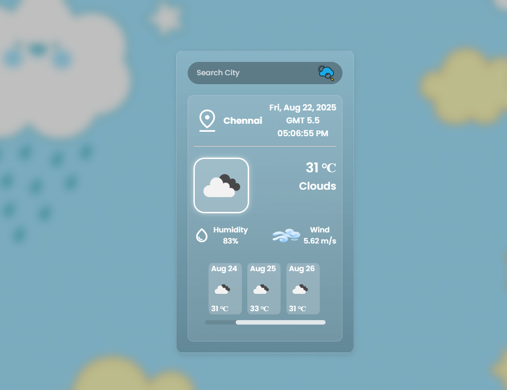

# 🌤 SkyForecast

**SkyForecast** is a modern weather forecasting web application that allows users to check real-time weather conditions for any location. It provides an intuitive interface with accurate weather data and forecasts.  

---
## 🖼 Preview

Here is a preview of the SkyForecast app:



> This is a screenshot of the app.  

---

## 🔗 Live Demo

Check out the live version here: [SkyForecast Live Demo](https://arpankhare-63.github.io/SkyForecast/)

## 🔹 Features

- Search weather by **city or location**
- View **current weather**, including temperature, humidity, and wind speed
- **5-day weather forecast**
- Responsive and user-friendly design
- Easy to integrate with other projects

---

## 💻 Technologies Used

- **Frontend:** HTML, CSS, JavaScript  
- **Framework:** React.js (if used) / Vanilla JS  
- **APIs:** OpenWeatherMap API (or any weather API)  
- **Version Control:** Git & GitHub

---

## ⚡ Installation & Setup

1. **Clone the repository**
```bash
git clone https://github.com/arpankhare-63/SkyForecast.git
---

## 🌍 Usage

- ** Enter the city name in the search bar.

- ** Press Enter or click Search.

- **View the current weather and upcoming forecast.
